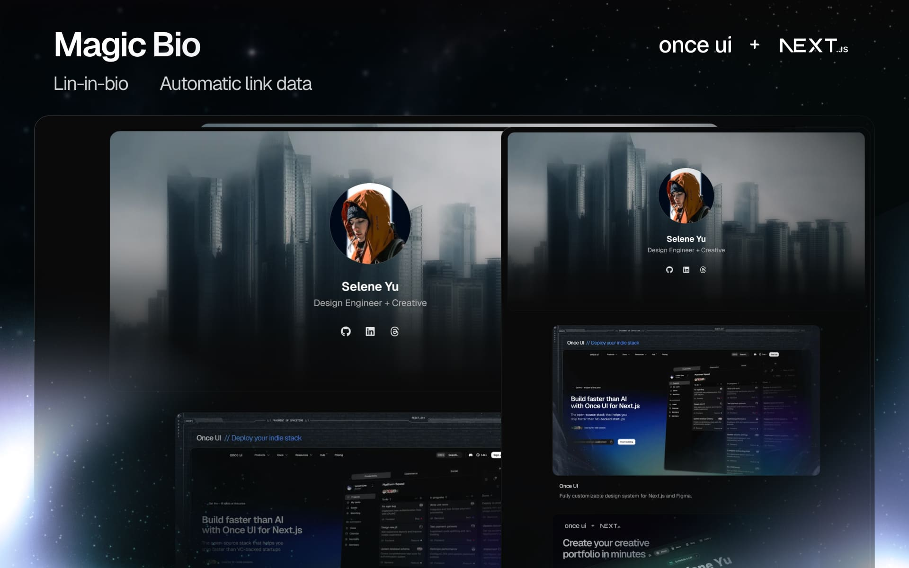

# Magic Bio

Magic Bio is a simple link-in-bio template that automatically displays data based on URLs.

View the demo [here](https://lorant.bio).



## Getting started

**1. Clone the repository**
```
git clone https://github.com/once-ui-system/magic-bio.git
```

**2. Install dependencies**
```
npm install
```

**3. Run dev server**
```
npm run dev
```

**4. Edit content**
```
src/resources/content.js
```

## Features

### Once UI
- All tokens, components & features of [Once UI](https://once-ui.com) available through NPM

### SEO
- Automatic open-graph and X image generation with next/og
- Automatic schema and metadata generation based on the content file

### Content
- Automatic data resolution that generates project details based on the link's open-graph tags
- Override content by providing any parameters explicitly in the content file

## Creators

Lorant One: [Threads](https://www.threads.net/@lorant.one) / [LinkedIn](https://www.linkedin.com/in/lorant-one/)

## Get involved

- Join the Design Engineers Club on [Discord](https://discord.com/invite/5EyAQ4eNdS) and share your project with us!
- Deployed your docs? Share it on the [Once UI Hub](https://once-ui.com/hub) too! We feature our favorite apps on our landing page.

## License

Distributed under the CC BY-NC 4.0 License.
- Attribution is required.
- Commercial usage is not allowed.
- You can extend the license to [Dopler CC](https://dopler.app/license) by purchasing a [Once UI Pro](https://once-ui.com/pricing) license.

See `LICENSE.txt` for more information.

## Deploy with Vercel

[](https://vercel.com/new/clone?repository-url=https%3A%2F%2Fgithub.com%2Fonce-ui-system%2Fmagic-bio&project-name=magic-bio&repository-name=magic-bio&redirect-url=https%3A%2F%2Fgithub.com%2Fonce-ui-system%2Fmagic-bio&demo-title=Magic%20Bio&demo-description=Showcase%20your%20designers%20or%20developer%20portfolio&demo-url=https%3A%2F%2Fdemo.magic-bio.com&demo-image=%2F%2Fraw.githubusercontent.com%2Fonce-ui-system%2Fmagic-bio%2Fmain%2Fpublic%2Fimages%2Fog.jpg)